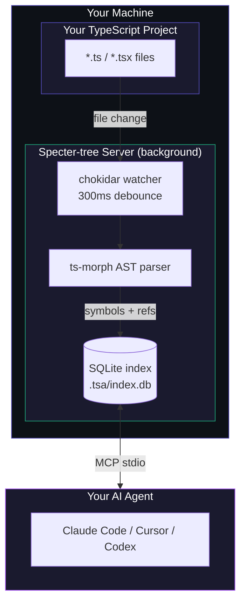
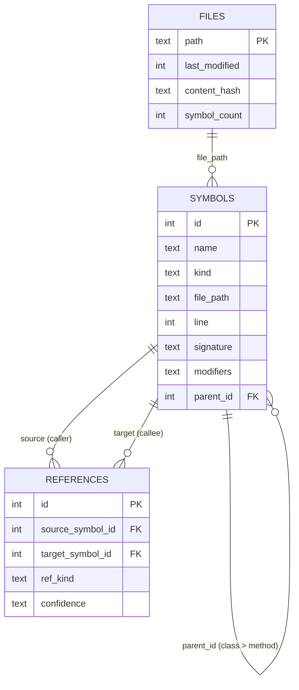

<div align="center">

# Specter-Tree

**Give your AI a map of your TypeScript codebase.**

*Instead of reading 10 files to find one function — ask once, get the exact line.*

[](LICENSE)
[](https://bun.sh)
[](https://modelcontextprotocol.io)
[]()
[](CONTRIBUTING.md)

</div>

---

## What Is This?

Specter-tree is a TypeScript-aware MCP server. It builds a live structural index of your codebase so coding agents — Claude Code, Codex CLI, Cursor, or any MCP stdio client — can ask for exact symbols, call sites, routes, and config values instead of searching blindly through files.

- *Where is `handleLogin` defined?* → Exact file and line number, instantly.
- *What calls `validateUser`?* → Every call site across your whole project.
- *What does this class extend?* → The full inheritance chain.

Without Specter-tree, an agent scans grep output, reads whole files, and often opens the wrong place first. With Specter-tree, it asks one structural question and gets one precise answer.

---

## What Is MCP?

MCP (Model Context Protocol) is the standard way coding agents connect to external tools. Specter-tree is one such MCP server. Once connected, the agent can call its structural code-navigation tools during a conversation instead of relying on text search.

The key idea is simple: your coding agent launches the Specter-tree stdio server for the session, then binds it to the current workspace root using the `set_project_root` tool — no manual path configuration needed.

---

## The Promise

Normal workflow once set up:

1. Clone this repo and run `bun run dev`.
2. Specter-tree prints the MCP config JSON and a ready-to-paste prompt.
3. Open your AI agent (Claude Code, Codex, Cursor, etc.) in the project you want to work on.
4. Paste the printed output into the agent.
5. The agent configures the MCP connection, binds `tsa` to the current workspace, and starts navigating with `tsa` before grep or glob.

---

## Set Up in 3 Steps

### Prerequisites

Install [Bun](https://bun.sh) if you do not have it:

```bash
curl -fsSL https://bun.sh/install | bash
```

Specter-tree works on macOS, Linux, and Windows (WSL or Git Bash).

---

### Step 1 — Install Specter-Tree

```bash
git clone https://github.com/DinoQuinten/specter-tree.git
cd specter-tree/tsa-mcp-server
bun install
```

---

### Step 2 — Run the Server Once

From `specter-tree/tsa-mcp-server`:

```bash
bun run dev
```

The startup banner prints:

- The MCP config JSON your agent needs to connect.
- The prompt text that tells the agent how to connect and use `tsa`.
- The currently detected project root for visibility and debugging.

Copy everything in the printed setup block — you will paste it into your agent in the next step.

To copy the prompt directly to your clipboard:

```bash
# macOS
bun run dev --prompt | pbcopy

# Windows
bun run dev --prompt | clip

# Linux
bun run dev --prompt | xclip -selection clipboard
```

---

### Step 3 — Paste the Output Into Your Agent

Open your AI agent in the project you want to work on, then paste the printed setup block from `bun run dev`.

The agent should then:

1. Add or update the MCP configuration for `tsa`.
2. Confirm the server is available and list its tools.
3. Call `set_project_root` with the current workspace root.
4. Begin using `tsa` for all code navigation.

That is the complete onboarding flow. You should not need to hardcode `TSA_PROJECT_ROOT` or manually edit `.mcp.json` in normal use.

---

### What the Agent Receives

The printed output contains an MCP config block in this shape:

```json
{
  "mcpServers": {
    "tsa": {
      "command": "bun",
      "args": ["run", "/absolute/path/to/specter-tree/tsa-mcp-server/src/index.ts"]
    }
  }
}
```

The path shown is the **actual path on your machine** — not a placeholder. The agent is expected to use this config to wire up the MCP connection automatically.

For advanced or manual setups, you can also override the project root:

```bash
bun run dev --project /path/to/project
TSA_PROJECT_ROOT=/path/to/project bun run dev
```

---

## What Happens After You Paste the Prompt

The agent should work through this sequence automatically:

1. Use the printed MCP config to connect `tsa`.
2. Confirm that the `tsa` MCP server is available.
3. Inspect the available `tsa` tools and resources.
4. Call `set_project_root` with the active workspace root.
5. Find the exact symbol, file, or route using `tsa`.
6. Read only the smallest code region needed.
7. Call `flush_file` after any edit so the index stays fresh.

---

## The Problem It Solves

Without Specter-tree, every navigation task burns tokens:

```
Task: find startServer and add a startup greeting

  Step 1  Glob all .ts files              ->  31 paths listed
  Step 2  Grep for "startServer"          ->  6 matching lines, scan output
  Step 3  Read server.ts (full file)      ->  126 lines — needed 20
  ──────────────────────────────────────────────────────────────
  Total:  ~1350 tokens        Lines actually needed: 20 of 126
```

With Specter-tree:

```
Task: find startServer and add a startup greeting

  Step 1  find_symbol("startServer")      ->  server.ts line 111, exact
  Step 2  Read server.ts lines 111-130    ->  20 lines, nothing else
  ──────────────────────────────────────────────────────────────
  Total:  ~500 tokens         Lines actually needed: 20 of 20
```

Same task. Same edit. **63% fewer tokens.**

Savings grow with task complexity:

```
SIMPLE  find one function, edit it
██████████████████████████████████████████████████  1350 tok  Grep
██████████████████                                   500 tok  Specter-tree    63% saved

MEDIUM  trace callers across 3 files
█████████████████████████████████████████████████████████████████████  2850 tok  Grep
████████████████████                                                   900 tok  Specter-tree    68% saved

LARGE   map full inheritance, 15+ files
████████████████████████████████████████████████████████████████████████████████  4800 tok  Grep
████████████████                                                                 1000 tok  Specter-tree    79% saved
```

> Savings compound with depth. The larger the navigation task, the bigger the gap.

---

## How It Works

There are two moving parts:

1. **The Specter-tree server** — runs on your machine, watches the currently bound TypeScript project, and keeps a SQLite index of every symbol and reference. It uses zero tokens.

2. **Your AI agent** — Claude Code, Codex, Cursor, or any MCP-compatible client. Once connected, it calls Specter-tree tools during the conversation instead of reading raw files first.

The key point: **the server and your AI agent are separate processes.** The MCP client launches a dedicated server process per session — one pipe, one process, one index. Two agents on two projects never share state. The agent binds its process to the current workspace root using `set_project_root`.



### Index Freshness

| Event | Latency | Mechanism |
|---|---|---|
| File saved | ~300ms | chokidar debounce, then `reindexFile` |
| File deleted | Immediate | Database entry removed |
| AI edits a file | Instant | `flush_file` bypasses the debounce |
| Cold start | One-time scan | Two-pass; hash-skips unchanged files |
| Project switch | On demand | `set_project_root` tears down old state and scans the new root. In-flight queries finish before the swap. |

The index for each project lives at `{project_root}/.tsa/index.db` — created automatically, wiped on every bind. Add `.tsa/` to your `.gitignore`; it is generated output and should not be committed.

---

## Available Tools

Once connected, your AI has 18 structural tools instead of blind file reading.

### Find Symbols

| Tool | What It Does |
|---|---|
| `find_symbol(name)` | Locate any function, class, or interface by exact name. Returns file and line. |
| `search_symbols(query)` | Fuzzy or partial name search across the whole project. |
| `get_file_symbols(file_path)` | List every symbol declared in a file. |
| `get_methods(class_name)` | All methods and properties on a class. |

### Understand Relationships

| Tool | What It Does |
|---|---|
| `get_callers(symbol_name)` | Every place in the project that calls this function. |
| `get_hierarchy(class_name)` | What does this class extend? What does it implement? |
| `get_implementations(interface_name)` | All classes that implement this interface. |
| `get_related_files(file_path)` | What does this file import? What imports it? |

### Framework and Config

| Tool | What It Does |
|---|---|
| `trace_middleware(route_path)` | What middleware runs before this route handler? |
| `get_route_config(url_path)` | Route handler, guards, and redirects for a URL. |
| `resolve_config(key)` | What is this config value and where does it come from? |

### High-Level Insight (Saves the Most Tokens)

| Tool | What It Does |
|---|---|
| `summarize_file_structure(file_path)` | Compact anatomy of a file — exports, classes, functions, and imports. |
| `explain_flow(symbol_name?, file_path?, route_path?, max_depth?)` | Trace the call graph from any entrypoint. Exactly one of the first three parameters is required. |
| `find_write_targets(symbol_name)` | Ranked list of where to actually make an edit. |
| `resolve_exports(file_path, export_name)` | Follow barrel re-exports to the actual declaration file and line. |

### Index Control

| Tool | What It Does |
|---|---|
| `set_project_root(project_root)` | Bind `tsa` to a workspace root, scan it, and replace all services. Used by the agent at session start. |
| `flush_file(file_path)` | Force immediate re-index after an edit, bypassing the 300ms debounce. |
| `index_project(root)` | Full re-scan of the active root. |

### Browse Without Tool Calls (MCP Resources)

| URI | Returns |
|---|---|
| `tsa://files` | All indexed TypeScript file paths. |
| `tsa://symbols` | All distinct symbol names. |
| `tsa://file/{path}` | Every symbol declared in a specific file. |
| `tsa://symbol/{name}` | Full record for a named symbol. |

---

## Environment Variables

| Variable | Required | Default | Description |
|---|---|---|---|
| `TSA_PROJECT_ROOT` | No | Auto-detected | Advanced override for the initial root before `set_project_root` is called. Not needed in normal use. |
| `TSA_DB_PATH` | No | `{root}/.tsa/index.db` | Where to store the SQLite index. |
| `LOG_LEVEL` | No | `info` | `debug` / `info` / `warn` / `error` |
| `NODE_ENV` | No | `development` | `development` / `production` |

In normal usage, the agent calls `set_project_root` after connecting. You do not need to set `TSA_PROJECT_ROOT` manually.

**If no override is provided, the initial root is detected in this order:**

1. `--project <path>` CLI flag.
2. `TSA_PROJECT_ROOT` environment variable.
3. Nearest `tsconfig.json` found by walking up from the current directory.
4. Current directory as a last resort.

---

## Benchmark — Real Data, This Codebase

Run against this repository (31 TypeScript source files). Same task both rounds: *add a startup greeting to the MCP server.* Run twice in opposite orders to eliminate first-run bias.

```
                    Test 1              Test 2
                    (specter first)     (grep first)

Specter-tree        ~500 tok            ~800 tok
Grep + Read         ~1350 tok           ~1750 tok

Reduction           63%                 54%
```

| Stage | Without Specter-tree | With Specter-tree | Saving |
|---|---|---|---|
| Navigation | 400–450 tok | ~350 tok | ~15% |
| Wrong file reads | 0–300 tok | 0 tok | 100% |
| Correct file reads | ~850 tok (full file) | ~150 tok (20 lines) | ~82% |
| **Total** | **1350–1750 tok** | **500–800 tok** | **54–67%** |

**What the data corrected:** We predicted wrong reads would dominate savings. They did not. The biggest saving came from partial reads. The line number from `find_symbol` means the AI reads 20 lines instead of a 126-line file. That single mechanism accounts for more than half the total saving.

---

## Frequently Asked Questions

**Can two projects share one server?**

No. The MCP stdio transport is a one-to-one pipe — one agent session, one server process, one index. If you have Claude Code open on project A and Cursor open on project B, each spawns its own process. They never share state.

**How do I switch projects mid-session?**

Call `set_project_root("/path/to/other-project")`. The server wipes the old index, scans the new root, and replaces all services atomically. In-flight queries finish before the swap. Your agent does not need to reconnect.

**Where does the index live?**

At `{project_root}/.tsa/index.db`. Created automatically on first scan, wiped clean on every `set_project_root` call. Add `.tsa/` to your `.gitignore` — it is generated output and should not be committed.

**Which agents does this work with?**

Tested with Claude Code, Codex CLI, and Cursor. Any client that supports MCP stdio transport and can run `bun` will work.

**The index seems stale — what do I do?**

Call `flush_file(file_path)` after any edit to force an immediate re-index of that file, bypassing the 300ms debounce. For a full re-scan of the whole project, call `index_project(root)`.

**Does it index `node_modules`?**

No. Only your project files are indexed. For external package symbols, fall back to grep.

---

## Limitations

Specter-tree indexes **your project files only**. External packages in `node_modules` return no results — for those, fall back to grep. Both benchmark runs hit this when looking up methods from the MCP SDK.

The call graph is **best-effort, not exhaustive**. Known gaps:

- Dependency injection (`@Inject` providers).
- Event emitters (string-based event names).
- Dynamic dispatch (`obj[methodName]()`).
- Higher-order functions and callbacks.
- Calls routed through a passed-in parameter (e.g. `runtime.setProjectRoot(...)` where `runtime` is an argument).

All call graph results include a `confidence` field:

| Value | Meaning |
|---|---|
| `direct` | A static call expression — the compiler can see it. High confidence. |
| `inferred` | Resolved through a known pattern (e.g. interface implementation). Treat as likely but not certain. |
| `weak` | Structural guess — same name, compatible signature. Verify before acting on it. |

---

## Under the Hood



Specter-tree uses SQLite B+trees for all symbol and reference storage. Lookups are O(log n), typically 3–4 page reads for 5,000 symbols — sub-millisecond. The call graph uses an adjacency list rather than closure tables, so writes are O(1) per edge. Multi-hop traversals use recursive CTEs.

---

## Contributing

### Add a Language

The parser is TypeScript-only (ts-morph). To add Python, Go, Rust, or any other language:

1. Implement the parser interface alongside `src/services/ParserService.ts`.
2. Return the same `Symbol[]` and `Reference[]` structures.
3. Register the parser for the relevant file extensions in `IndexerService`.

### Add a Framework

`trace_middleware` and `get_route_config` use the `IFrameworkResolver` interface. Currently supported: Express, Next.js, and SvelteKit.

To add Fastify, Hono, Remix, Nuxt, or another framework:

1. Create `src/framework/your-framework-resolver.ts`.
2. Implement `IFrameworkResolver`.
3. Add detection logic in `FrameworkService.detectFrameworks()`.

### Development Setup

```bash
git clone https://github.com/DinoQuinten/specter-tree.git
cd specter-tree/tsa-mcp-server
bun install
bun test              # 97 tests
bun run typecheck     # type check, must exit clean
bun run dev           # start the server
```

Git hooks enforce quality on every commit and push:

- **pre-commit:** Scans staged files for secrets (gitleaks) and checks for duplicate symbols.
- **pre-push:** Runs the full test suite and type check.

---

## Roadmap

- [x] Layer 1: Offline indexer with incremental updates.
- [x] Layer 2: Symbol and reference query tools.
- [x] Layer 3: Framework detection and config resolution.
- [x] Layer 4: Insight tools — summarize, resolve exports, write targets, flow.
- [x] MCP Resources for index browsing without tool calls.
- [x] Graceful shutdown with in-flight request drain.
- [x] Coloured startup banner with ready-to-paste agent prompt.
- [x] `--prompt` flag generates exact connection config with real paths.
- [x] `set_project_root` tool — agent binds the workspace without env var setup.
- [x] Benchmark against Claude Code native tools.
- [ ] npm package for `npx` installation.
- [ ] Language parser plugin system.
- [ ] Python parser (tree-sitter).
- [ ] Selective `node_modules` indexing for external SDK types.
- [ ] Batch query tool (multiple queries in one MCP call).

---

## License

AGPL-3.0-only
