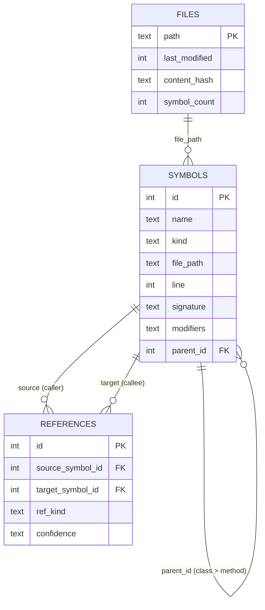

<div align="center">

# specter-tree

**Give your AI a map of your TypeScript codebase**

*Instead of reading 10 files to find one function — ask once, get the exact line.*

[](LICENSE)
[](https://bun.sh)
[](https://modelcontextprotocol.io)
[]()
[](CONTRIBUTING.md)

</div>

---

## What is this?

specter-tree is a background server that reads your TypeScript project and builds a live index of every function, class, interface, and reference in it. Your AI coding assistant (Claude Code, Cursor, Codex) connects to that index and can answer questions like:

- *Where is `handleLogin` defined?* → exact file + line number, instantly
- *What calls `validateUser`?* → every call site across your whole project
- *What does this class extend?* → full inheritance chain

Without specter-tree, your AI reads whole files, scans grep results, and sometimes opens the wrong file entirely. With specter-tree it asks one question and gets one precise answer.

---

## What is MCP?

MCP (Model Context Protocol) is a standard way for AI assistants to talk to external tools. Think of it like a plugin system — you run a small server locally, tell your AI where it is, and the AI can call its tools during a conversation.

specter-tree is one such server. Once connected, your AI has 17 tools for navigating your codebase structurally instead of by text search.

---

## The problem it solves

Without specter-tree, every navigation task burns tokens:

```
Task: find startServer and add a startup greeting

  Step 1  Glob all .ts files              ->  31 paths listed
  Step 2  Grep for "startServer"          ->  6 matching lines, scan output
  Step 3  Read server.ts (full file)      ->  126 lines — needed 20
  ──────────────────────────────────────────────────────────────
  Total:  ~1350 tokens        Lines actually needed: 20 of 126
```

With specter-tree:

```
Task: find startServer and add a startup greeting

  Step 1  find_symbol("startServer")      ->  server.ts line 111, exact
  Step 2  Read server.ts lines 111-130    ->  20 lines, nothing else
  ──────────────────────────────────────────────────────────────
  Total:  ~500 tokens         Lines actually needed: 20 of 20
```

Same task. Same edit. **63% fewer tokens.**

Savings grow with task complexity:

```
SIMPLE  find one function, edit it
██████████████████████████████████████████████████  1350 tok  Grep
██████████████████                                   500 tok  specter-tree    63% saved

MEDIUM  trace callers across 3 files
█████████████████████████████████████████████████████████████████████  2850 tok  Grep
████████████████████                                                   900 tok  specter-tree    68% saved

LARGE   map full inheritance, 15+ files
████████████████████████████████████████████████████████████████████████████████  4800 tok  Grep
████████████████                                                                 1000 tok  specter-tree    79% saved
```

---

## How it works

There are two moving parts:

1. **The specter-tree server** — runs on your machine, watches your TypeScript project, keeps a SQLite index of every symbol and reference. Uses zero tokens. Runs in the background.

2. **Your AI agent** — Claude Code, Cursor, Codex, etc. Once you give it the connection config, it can call specter-tree tools during a conversation instead of reading raw files.

The key thing to understand: **the server and your AI agent are separate processes.** The server needs to know where your project lives. The agent needs to know where the server is. This README walks you through connecting both ends.


---

## Setup — 3 steps

### Prerequisites

Install [Bun](https://bun.sh) if you don't have it:

```bash
curl -fsSL https://bun.sh/install | bash
```

---

### Step 1 — Install specter-tree

```bash
git clone https://github.com/DinoQuinten/specter-tree.git
cd specter-tree/tsa-mcp-server
bun install
```

---

### Step 2 — Start the server pointing at your project

```bash
cd specter-tree/tsa-mcp-server
TSA_PROJECT_ROOT=/path/to/your/typescript/project bun run dev
```

Replace `/path/to/your/typescript/project` with the actual folder containing your `tsconfig.json`.

**Windows example:**
```bash
TSA_PROJECT_ROOT="C:\Users\you\projects\my-app" bun run dev
```

**Don't know the path?** Just `cd` into your project and use `$PWD`:
```bash
TSA_PROJECT_ROOT=$PWD bun run dev
```

When it starts you'll see a banner confirming the project root and database path, followed by a **ready-to-paste connection prompt** for your AI agent:

```
  ╔═════════════════════════════════════════════════╗
  ║  specter-tree  v0.1.0                           ║
  ║  TypeScript AST codebase intelligence           ║
  ╚═════════════════════════════════════════════════╝

  Project root   /your/project
  Database       /your/project/.tsa/index.db

  ──────────────────────────────────────────────────────
  Paste this into Codex, Claude Code, or any MCP-capable agent:
  ──────────────────────────────────────────────────────

  │ STEP 1 — Connect the MCP server
  │ Add the following to your .mcp.json:
  │
  │ {
  │   "mcpServers": {
  │     "tsa": {
  │       "command": "bun",
  │       "args": ["run", "/actual/path/to/tsa-mcp-server/src/index.ts"],
  │       "env": { "TSA_PROJECT_ROOT": "/your/project" }
  │     }
  │   }
  │ }
  …

  ● Indexing project files…  Ctrl+C to stop
```

> The JSON config shown **contains your actual paths** — not placeholders. Copy it directly.

---

### Step 3 — Connect your AI agent

The banner and `--prompt` flag both print a JSON block with your exact server path and project root. Use it to connect your agent:

#### Get the connection config

```bash
# Print to terminal
bun run dev --prompt

# Copy to clipboard — macOS
bun run dev --prompt | pbcopy

# Copy to clipboard — Windows
bun run dev --prompt | clip

# Copy to clipboard — Linux
bun run dev --prompt | xclip -selection clipboard
```

#### Paste into your agent

**Claude Code** — create `.mcp.json` in your project root:

Paste the JSON block from `--prompt` output. It looks like:

```json
{
  "mcpServers": {
    "tsa": {
      "command": "bun",
      "args": ["run", "/your/actual/path/tsa-mcp-server/src/index.ts"],
      "env": {
        "TSA_PROJECT_ROOT": "/your/actual/project"
      }
    }
  }
}
```

**Claude Code CLI** (one-liner):

```bash
claude mcp add --scope project tsa -- bun run /your/actual/path/tsa-mcp-server/src/index.ts
```

**Cursor** — add to `~/.cursor/mcp.json` using the same JSON shape. Use `${workspaceFolder}` for `TSA_PROJECT_ROOT` if you want it to follow whichever project you have open.

After saving, **reload your agent session**. When the session starts, paste the full prompt text from `bun run dev --prompt` into your first message. The agent will confirm the connection and start using specter-tree tools automatically.

---

### That's it

specter-tree scans your project on first run (~5-10 seconds for most codebases), then watches for file changes. The index stays live as you edit. No rebuilds. No restarts.

---

## What can your AI do now?

Once connected, your AI has 17 structural tools instead of blind file reading:

### Find things

| Tool | What it does |
|---|---|
| `find_symbol(name)` | Locate any function, class, interface by exact name → returns file + line |
| `search_symbols(query)` | Fuzzy/partial name search across the whole project |
| `get_file_symbols(file_path)` | List every symbol declared in a file |
| `get_methods(class_name)` | All methods and properties on a class |

### Understand relationships

| Tool | What it does |
|---|---|
| `get_callers(symbol_name)` | Every place in the project that calls this function |
| `get_hierarchy(class_name)` | What does this class extend? What does it implement? |
| `get_implementations(interface_name)` | All classes that implement this interface |
| `get_related_files(file_path)` | What does this file import? What imports it? |

### Framework and config

| Tool | What it does |
|---|---|
| `trace_middleware(route_path)` | What middleware runs before this route handler? |
| `get_route_config(url_path)` | Route handler, guards, and redirects for a URL |
| `resolve_config(key)` | What is this config value and where does it come from? |

### High-level insight (saves the most tokens)

| Tool | What it does |
|---|---|
| `summarize_file_structure(file_path)` | Compact anatomy of a file — exports, classes, functions, imports |
| `explain_flow(symbol/file/route)` | Trace the call graph from any entrypoint |
| `find_write_targets(symbol_name)` | Ranked list of where to actually make an edit |
| `resolve_exports(file_path, name)` | Follow barrel re-exports to the actual declaration file |

### Index control

| Tool | What it does |
|---|---|
| `flush_file(file_path)` | Force immediate re-index after an edit (bypasses the 300ms debounce) |
| `index_project(root)` | Full project re-scan |

### Browse without tool calls (MCP Resources)

| URI | Returns |
|---|---|
| `tsa://files` | All indexed TypeScript file paths |
| `tsa://symbols` | All distinct symbol names |
| `tsa://file/{path}` | Every symbol in a specific file |
| `tsa://symbol/{name}` | Full record for a named symbol |

---

## Environment variables

| Variable | Required | Default | Description |
|---|---|---|---|
| `TSA_PROJECT_ROOT` | No | Auto-detected | TypeScript project to index |
| `TSA_DB_PATH` | No | `{root}/.tsa/index.db` | Where to store the SQLite index |
| `LOG_LEVEL` | No | `info` | `debug` / `info` / `warn` / `error` |
| `NODE_ENV` | No | `development` | `development` / `production` |

**How `TSA_PROJECT_ROOT` is found if you don't set it:**

1. `--project <path>` CLI flag
2. `TSA_PROJECT_ROOT` env var
3. Nearest `tsconfig.json` found walking up from the current directory
4. Current directory as last resort

---

## Benchmark — real data, this codebase

Run against this repository (31 TypeScript source files). Same task both rounds: *add a startup greeting to the MCP server.* Run twice in opposite orders to eliminate first-run bias.

```
                    Test 1              Test 2
                    (specter first)     (grep first)

specter-tree        ~500 tok            ~800 tok
Grep + Read         ~1350 tok           ~1750 tok

Reduction           63%                 54%
```

| Stage | Without specter-tree | With specter-tree | Saving |
|---|---|---|---|
| Navigation | 400-450 tok | ~350 tok | ~15% |
| Wrong file reads | 0-300 tok | 0 tok | 100% |
| Correct file reads | ~850 tok (full file) | ~150 tok (20 lines) | ~82% |
| **Total** | **1350-1750 tok** | **500-800 tok** | **54-67%** |

**What the data corrected:** We predicted wrong reads would dominate. They didn't. The biggest saving was partial reads — `find_symbol` returns the exact line so the AI reads 20 lines instead of a 126-line file. That single mechanism accounts for more than half the total saving.

---

## Limitations

specter-tree indexes **your project files only**. External packages in `node_modules` return no results — for those, fall back to grep. Both benchmark runs hit this when looking up methods from the MCP SDK.

The call graph is **best-effort, not exhaustive**. Known gaps:

- Dependency injection (`@Inject` providers)
- Event emitters (string-based event names)
- Dynamic dispatch (`obj[methodName]()`)
- Higher-order functions and callbacks
- Re-exports through barrel files

All call graph results include a `confidence` field: `direct`, `inferred`, or `weak`.

---

## Under the hood



SQLite B+trees for all symbol and reference storage. Lookups are O(log n), typically 3-4 page reads for 5,000 symbols. Sub-millisecond. The call graph uses an adjacency list (not closure tables) — writes are O(1) per edge, multi-hop traversals use recursive CTEs.

---

## Contributing

### Add a language

The parser is TypeScript-only (ts-morph). To add Python, Go, Rust, or anything else:

1. Implement the parser interface alongside `src/services/ParserService.ts`
2. Return the same `Symbol[]` and `Reference[]` structures
3. Register it for file extensions in `IndexerService`

### Add a framework

`trace_middleware` and `get_route_config` use the `IFrameworkResolver` interface. Currently supported: Express, Next.js, SvelteKit.

To add Fastify, Hono, Remix, Nuxt:

1. Create `src/framework/your-framework-resolver.ts`
2. Implement `IFrameworkResolver`
3. Add detection in `FrameworkService.detectFrameworks()`

### Development

```bash
git clone https://github.com/DinoQuinten/specter-tree.git
cd specter-tree/tsa-mcp-server
bun install
bun test              # 82 tests
bun run typecheck     # type check
bun run dev           # start server
```

Hooks: pre-commit checks for secrets (gitleaks) and duplicate symbols. Pre-push runs tests + typecheck.

---

## Roadmap

- [x] Layer 1: Offline indexer with incremental updates
- [x] Layer 2: Symbol and reference query tools
- [x] Layer 3: Framework detection + config resolution
- [x] Layer 4: Insight tools — summarize, resolve exports, write targets, flow
- [x] MCP Resources for index browsing without tool calls
- [x] Graceful shutdown with in-flight request drain
- [x] Coloured startup banner with ready-to-paste agent prompt
- [x] `--prompt` flag generates exact connection config with real paths
- [x] Benchmark against Claude Code native tools
- [ ] npm package for `npx` installation
- [ ] Language parser plugin system
- [ ] Python parser (tree-sitter)
- [ ] Selective node_modules indexing for external SDK types
- [ ] Batch query tool (multiple queries in one MCP call)

---

## License

AGPL-3.0-only
