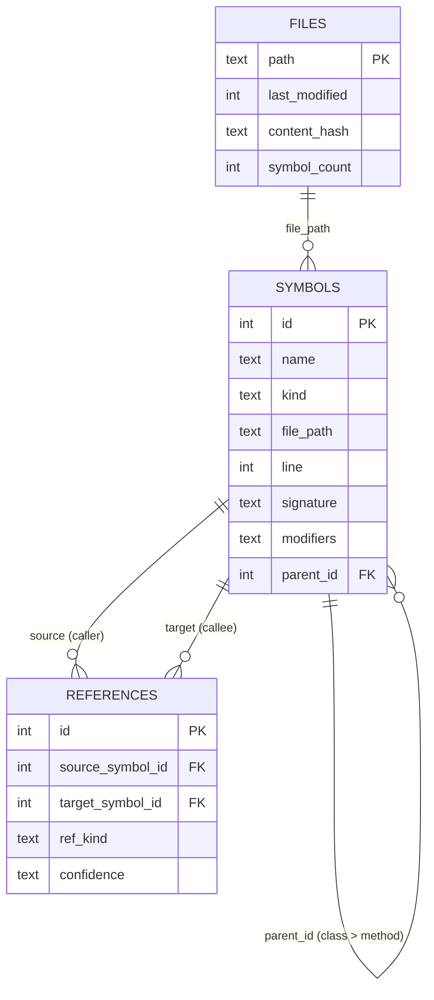

<div align="center">

# Specter-Tree — Reduce Claude Code Token Usage by 54–67%

**Your AI assistant stops guessing where code lives.**

*It asks once. Gets the exact file and line. Reads only what it needs.*

**Specter-Tree** is an open-source MCP server for web engineers using Claude Code, Cursor, or Codex CLI. When you're debugging, your agent queries by symbol name and gets the exact file and line — no full-file reads, no wrong guesses. Built for TypeScript projects, it cuts navigation token usage by 54–67% per session.

[](LICENSE)
[](https://bun.sh)
[](https://modelcontextprotocol.io)
[]()
[](CONTRIBUTING.md)

</div>

---

## Before and After — How AI Agents Navigate Your TypeScript Code

Your AI assistant wants to add a login check to `handleRequest`.

**Without Specter-Tree:**
```
1. Glob all .ts files          → 31 paths, scan the list
2. Grep for "handleRequest"    → 6 matches across 4 files
3. Read server.ts (full file)  → 126 lines, needed 20
─────────────────────────────────────────────────
~1350 tokens spent.  Lines actually needed: 20.
```

**With Specter-Tree:**
```
1. find_symbol("handleRequest") → server.ts, line 111, exact
2. Read server.ts lines 111–130 → 20 lines, nothing else
─────────────────────────────────────────────────
~500 tokens spent.  Lines actually needed: 20.
```

Same edit. Same result. **63% fewer tokens.**

---

## Why Debugging With Claude Code Burns So Many Tokens

When you're debugging and Claude Code, Cursor, or Codex navigates a TypeScript project, it has no structural knowledge. It globs for file names, greps for strings, and reads entire files to find 20 lines. Every wrong guess burns tokens. Every full-file read where a partial read would suffice burns tokens.

Specter-Tree gives the agent an indexed map: every function, class, interface, call site, and import relationship — pre-resolved and queryable in sub-millisecond time. The agent asks "where is handleRequest?" and gets `server.ts:111` instead of scanning 31 files. Debugging a deep call chain that would cost 4,800 tokens with grep costs 1,000 with Specter-Tree.

---

## Structural Queries vs Grep — What Changes for Your Agent

| Capability | Native grep / glob / read | Specter-Tree MCP |
|---|---|---|
| Find a function by name | Grep → read multiple files | `find_symbol` → exact file + line |
| Trace all callers | Read files manually | `get_callers` → indexed result |
| Check class hierarchy | Read inheritance chain manually | `get_hierarchy` → one call |
| Token cost (simple task) | 1,350–1,750 tokens | 500–800 tokens |
| Wrong file reads | 0–3 per task | 0 |
| Works with tsconfig path aliases | N/A | Yes (`@/`, `~/`, custom) |
| Setup time | None (built in) | ~2 minutes (git clone + bun install) |

---

## Who Benefits

- Web engineers debugging TypeScript projects with Claude Code, Codex CLI, or Cursor.
- Teams building AI-assisted dev workflows that need structural code context.
- Large TypeScript codebases where grep doesn't scale during debugging sessions.

You do not need to understand ASTs or SQLite to use this. You paste one prompt, and your agent handles the rest.

---

## What Is MCP?

MCP (Model Context Protocol) is the standard way AI coding agents connect to external tools. Think of it like a plugin system — your agent launches Specter-Tree as a background process and calls its tools during a conversation.

Specter-Tree is one such tool. Instead of reading raw files, your agent calls `find_symbol("AuthService")` and gets back the exact file and line number — no scanning required.

---

## Set Up in 3 Steps

### Prerequisites

Install [Bun](https://bun.sh) if you do not have it:

```bash
curl -fsSL https://bun.sh/install | bash
```

Specter-Tree works on macOS, Linux, and Windows (WSL or Git Bash).

---

### Step 1 — Install

```bash
git clone https://github.com/DinoQuinten/specter-tree.git
cd specter-tree/tsa-mcp-server
bun install
```

---

### Step 2 — Run it once

```bash
bun run dev
```

The terminal prints:

- The MCP config JSON your agent needs to connect.
- A ready-to-paste prompt that wires everything up automatically.
- The project root it detected on your machine.

To copy the prompt straight to your clipboard:

```bash
# macOS
bun run dev --prompt | pbcopy

# Windows
bun run dev --prompt | clip

# Linux
bun run dev --prompt | xclip -selection clipboard
```

---

### Step 3 — Paste into your agent

Open your AI agent in the project you want to work on. Paste the printed output.

The agent will:

1. Add the MCP config and connect to Specter-Tree.
2. Call `set_project_root` with your workspace path.
3. Start using `tsa` tools for all code navigation.

That is the full setup. No env vars to set. No config files to edit by hand.

---

## What the Agent Gets

The printed config looks like this — with your actual machine path embedded, not a placeholder:

```json
{
  "mcpServers": {
    "tsa": {
      "command": "bun",
      "args": ["run", "/your/path/to/specter-tree/tsa-mcp-server/src/index.ts"]
    }
  }
}
```

After connecting, the agent calls `set_project_root` once to bind Specter-Tree to the current workspace. From that point on it has 18 structural tools available.

---

## What the Agent Does After Setup

```
1. Connect to tsa using the printed MCP config.
2. Confirm the server is available and list its tools.
3. Call set_project_root with the active workspace root.
4. Use tsa to find the exact symbol, file, or route.
5. Read only the lines it needs.
6. Call flush_file after any edit to keep the index current.
```

---

## 18 MCP Tools for TypeScript Code Navigation

### Find Symbols

| Tool | What It Does |
|---|---|
| `find_symbol(name)` | Exact file and line for any function, class, or interface. |
| `search_symbols(query)` | Partial or fuzzy name search across the whole project. |
| `get_file_symbols(file_path)` | Every symbol declared in a file. |
| `get_methods(class_name)` | All methods and properties on a class. |

### Understand Relationships

| Tool | What It Does |
|---|---|
| `get_callers(symbol_name)` | Every place in the project that calls this function. |
| `get_hierarchy(class_name)` | What this class extends and what extends it. |
| `get_implementations(interface_name)` | All classes that implement this interface. |
| `get_related_files(file_path)` | What this file imports and what imports it. |

### Framework and Config

| Tool | What It Does |
|---|---|
| `trace_middleware(route_path)` | What middleware runs before this route handler. |
| `get_route_config(url_path)` | Route handler, guards, and redirects for a URL. |
| `resolve_config(key)` | What this config value is and where it comes from. |

### High-Level Insight — Saves the Most Tokens

| Tool | What It Does |
|---|---|
| `summarize_file_structure(file_path)` | Compact anatomy: exports, classes, functions, imports. One call replaces reading the whole file. |
| `explain_flow(symbol_name?, file_path?, route_path?, max_depth?)` | Trace the call graph from any entry point. Exactly one of the first three parameters is required. |
| `find_write_targets(symbol_name)` | Ranked list of where to actually make an edit — declaration first, then callers, then implementors. |
| `resolve_exports(file_path, export_name)` | Follow barrel re-exports to the actual declaration file and line. |

### Index Control

| Tool | What It Does |
|---|---|
| `set_project_root(project_root)` | Bind tsa to a workspace root, scan it, and replace all services. The agent calls this at session start. |
| `flush_file(file_path)` | Force an immediate re-index after an edit, bypassing the 300ms debounce. |
| `index_project(root)` | Full re-scan of the active root. |

### Browse Without Tool Calls (MCP Resources)

| URI | Returns |
|---|---|
| `tsa://files` | All indexed TypeScript file paths. |
| `tsa://symbols` | All distinct symbol names. |
| `tsa://file/{path}` | Every symbol declared in a specific file. |
| `tsa://symbol/{name}` | Full record for a named symbol. |

---

## How It Works

Two processes. One connection.

1. **Specter-Tree** — runs on your machine, watches your TypeScript files, and keeps a SQLite index of every symbol and reference. Uses zero tokens.
2. **Your AI agent** — Claude Code, Codex, Cursor, or any MCP stdio client. Once connected, it queries the index instead of reading files.

The MCP client launches a dedicated Specter-Tree process per session. Each session has its own process and its own index — sessions never share state. Specter-Tree is designed for developers who want to reduce LLM token usage in their coding workflow without changing how they write code.


### Index Freshness

| Event | Latency | Mechanism |
|---|---|---|
| File saved | ~300ms | chokidar debounce, then re-index |
| File deleted | Immediate | Database entry removed |
| AI edits a file | Instant | `flush_file` bypasses the debounce |
| Cold start | One-time scan | Two-pass; hash-skips unchanged files |
| Project switch | On demand | `set_project_root` tears down old state and scans the new root |

The index for each project lives at `{project_root}/.tsa/index.db` — created automatically, wiped on every bind. Add `.tsa/` to your `.gitignore`; it is generated output and should not be committed.

---

## Frequently Asked Questions — MCP Server Setup and Token Savings

### How much does Specter-Tree reduce Claude Code token usage while debugging?

54–67% per session in benchmarks run against this repo (31 TypeScript files). The biggest saving comes from partial reads: `find_symbol` returns the exact line, so the agent reads 20 lines instead of a 126-line file. Savings compound with debugging depth — tracing callers across 3 files saved 68%; mapping a full inheritance chain across 15 files saved 79%.

### How do I set up an MCP server for TypeScript code navigation with Claude Code?

Clone the repo, run `bun install`, then `bun run dev`. The server prints a ready-to-paste MCP config JSON and a one-line prompt. Paste the prompt into Claude Code — it adds the config and calls `set_project_root` automatically. Total setup: about 2 minutes.

### Can two TypeScript projects share one Specter-Tree MCP server?

No. The MCP stdio transport is a one-to-one pipe — one agent session, one server process, one index. If you have Claude Code on project A and Cursor on project B, each spawns its own process. They never share state.

### How do I switch TypeScript projects mid-session without reconnecting?

Call `set_project_root("/path/to/other-project")`. The server wipes the old index, scans the new root, and replaces all services atomically. Your agent does not need to reconnect.

### Where does the Specter-Tree index live?

At `{project_root}/.tsa/index.db`. Created automatically, wiped on every bind. Add `.tsa/` to `.gitignore`.

### Which AI coding agents work with Specter-Tree to reduce token usage?

Tested with Claude Code, Codex CLI, and Cursor. Any client that supports MCP stdio transport and can run `bun` will work.

### Why does my Specter-Tree index seem stale after editing a file?

Call `flush_file(file_path)` after any edit to force an immediate re-index, bypassing the 300ms debounce. For a full re-scan, call `index_project(root)`.

### Does Specter-Tree reduce tokens differently from caching or compression tools?

Yes. Specter-Tree does not cache responses, compress prompts, or delegate to a local model. It reduces tokens specifically through structural navigation — the agent gets exact file and line numbers so it reads fewer lines. The 54–67% saving comes entirely from that mechanism. Caching and compression tools solve a different problem.

### Does it index `node_modules` or external packages?

No. Only your project files are indexed. For external package symbols, fall back to grep.

---

## Benchmark — Real Numbers From This Repo

Run against this repository (31 TypeScript source files). Task: *add a startup greeting to the MCP server.* Run twice in opposite orders to eliminate first-run bias.

```
                    Test 1              Test 2
                    (Specter first)     (grep first)

Specter-Tree        ~500 tok            ~800 tok
Grep + Read         ~1350 tok           ~1750 tok

Reduction           63%                 54%
```

| Stage | Without Specter-Tree | With Specter-Tree | Saving |
|---|---|---|---|
| Navigation | 400–450 tok | ~350 tok | ~15% |
| Wrong file reads | 0–300 tok | 0 tok | 100% |
| Correct file reads | ~850 tok (full file) | ~150 tok (20 lines) | ~82% |
| **Total** | **1350–1750 tok** | **500–800 tok** | **54–67%** |

The biggest saving came from partial reads — not avoided wrong reads as we initially predicted. The line number from `find_symbol` means the agent reads 20 lines instead of a 126-line file. That single mechanism accounts for more than half the total saving.

Savings compound with task depth:

```
SIMPLE  find one function, edit it
██████████████████████████████████████████████████  1350 tok  Grep
██████████████████                                   500 tok  Specter-Tree    63% saved

MEDIUM  trace callers across 3 files
█████████████████████████████████████████████████████████████████████  2850 tok  Grep
████████████████████                                                   900 tok  Specter-Tree    68% saved

LARGE   map full inheritance, 15+ files
████████████████████████████████████████████████████████████████████████████████  4800 tok  Grep
████████████████                                                                 1000 tok  Specter-Tree    79% saved
```

These savings are specifically on navigation — the part that scales with codebase size. Specter-Tree does not cache, compress, or delegate to local models.

---

## Limitations

Specter-Tree indexes **your project files only**. External packages in `node_modules` return no results — fall back to grep for those.

The call graph is **best-effort, not exhaustive**. Known gaps:

- Dependency injection (`@Inject` providers).
- Event emitters (string-based event names).
- Dynamic dispatch (`obj[methodName]()`).
- Higher-order functions and callbacks.
- Calls routed through a passed-in parameter (e.g. `runtime.method()` where `runtime` is an argument).

All call graph results include a `confidence` field:

| Value | Meaning |
|---|---|
| `direct` | A static call expression — the compiler can see it. High confidence. |
| `inferred` | Resolved through a known pattern (e.g. interface implementation). Likely but not certain. |
| `weak` | Structural guess — same name, compatible signature. Verify before acting on it. |

---

## Environment Variables

| Variable | Required | Default | Description |
|---|---|---|---|
| `TSA_PROJECT_ROOT` | No | Auto-detected | Advanced override for the initial root before `set_project_root` is called. Not needed in normal use. |
| `TSA_DB_PATH` | No | `{root}/.tsa/index.db` | Where to store the SQLite index. |
| `LOG_LEVEL` | No | `info` | `debug` / `info` / `warn` / `error` |
| `NODE_ENV` | No | `development` | `development` / `production` |

In normal use the agent calls `set_project_root` after connecting. You do not need to set `TSA_PROJECT_ROOT` manually.

**If no override is set, the initial root is detected in this order:**

1. `--project <path>` CLI flag.
2. `TSA_PROJECT_ROOT` environment variable.
3. Nearest `tsconfig.json` found by walking up from the current directory.
4. Current directory as a last resort.

---

## Under the Hood



SQLite B+trees for all storage. Lookups are O(log n) — typically 3–4 page reads for 5,000 symbols, sub-millisecond. The call graph uses an adjacency list so writes are O(1) per edge. Multi-hop traversals use recursive CTEs.

---

## Contributing

### Add a Language

The parser is TypeScript-only (ts-morph). To add Python, Go, Rust, or any other language:

1. Implement the parser interface alongside `src/services/ParserService.ts`.
2. Return the same `Symbol[]` and `Reference[]` structures.
3. Register the parser for the relevant file extensions in `IndexerService`.

### Add a Framework

`trace_middleware` and `get_route_config` use the `IFrameworkResolver` interface. Currently supported: Express, Next.js, and SvelteKit.

To add Fastify, Hono, Remix, Nuxt, or another framework:

1. Create `src/framework/your-framework-resolver.ts`.
2. Implement `IFrameworkResolver`.
3. Add detection logic in `FrameworkService.detectFrameworks()`.

### Development Setup

```bash
git clone https://github.com/DinoQuinten/specter-tree.git
cd specter-tree/tsa-mcp-server
bun install
bun test              # 97 tests
bun run typecheck     # must exit clean
bun run dev           # start the server
```

Git hooks run on every commit and push:

- **pre-commit:** Scans staged files for secrets and checks for duplicate symbols.
- **pre-push:** Runs the full test suite and type check.

---

## Roadmap

- [x] Offline indexer with incremental updates.
- [x] Symbol and reference query tools.
- [x] Framework detection and config resolution.
- [x] Insight tools — summarize, resolve exports, write targets, flow.
- [x] MCP Resources for index browsing without tool calls.
- [x] Graceful shutdown with in-flight request drain.
- [x] Coloured startup banner with ready-to-paste agent prompt.
- [x] `--prompt` flag generates exact connection config with real paths.
- [x] `set_project_root` tool — agent binds the workspace without env var setup.
- [x] Benchmark against Claude Code native tools.
- [x] tsconfig `paths` alias resolution for non-relative imports.
- [ ] npm package for `npx` installation.
- [ ] Language parser plugin system.
- [ ] Python parser (tree-sitter).
- [ ] Selective `node_modules` indexing for external SDK types.
- [ ] Batch query tool (multiple queries in one MCP call).

---

## License

AGPL-3.0-only
