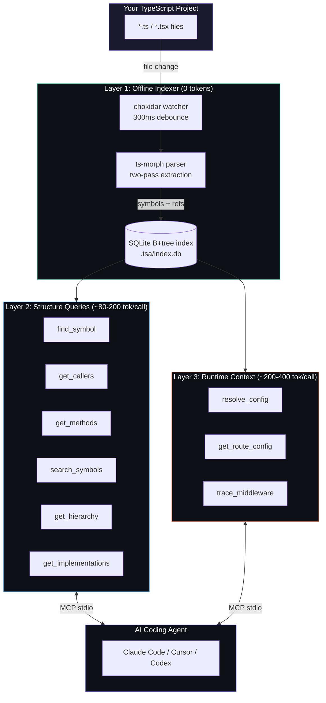
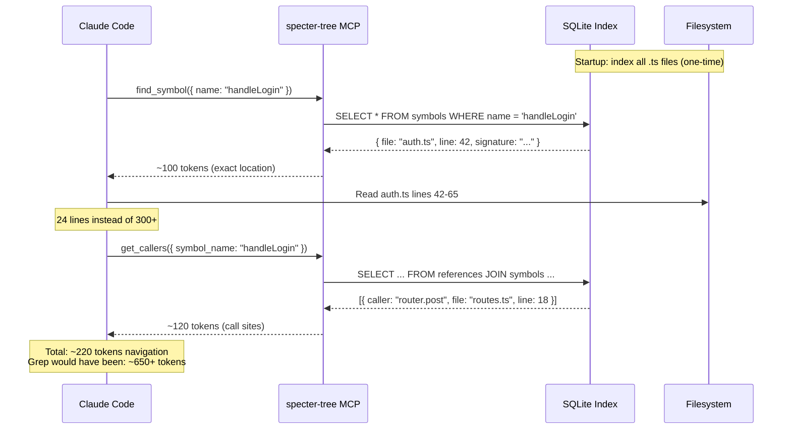
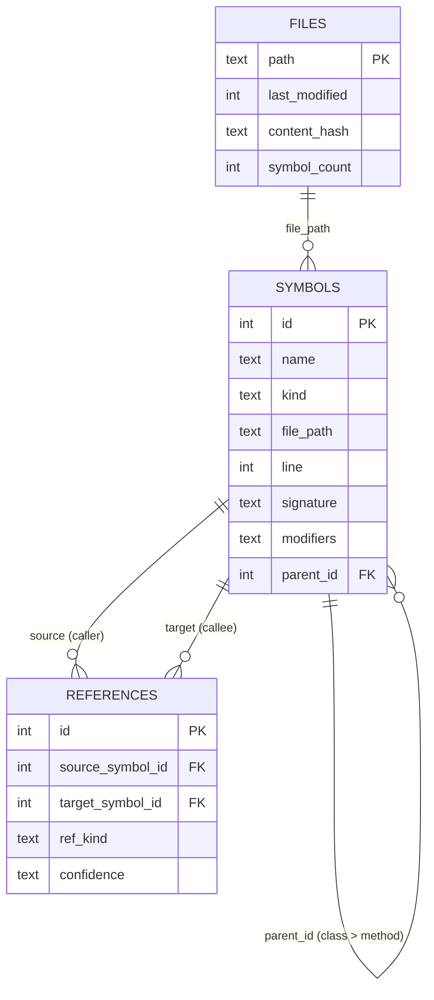

<div align="center">

# specter-tree

**TypeScript codebase intelligence for AI coding assistants**

*One query. Exact file. Exact line.*

[](LICENSE)
[](https://bun.sh)
[](https://modelcontextprotocol.io)
[]()
[](CONTRIBUTING.md)

</div>

---

specter-tree gives your AI a structural index of your TypeScript project. Instead of burning tokens reading files to find symbols, it queries a live SQLite index built from the actual AST.

Unlike grep, it walks through `.gitignore` walls -- worktrees, ignored directories, diverged branches. Everything indexed. Nothing hidden.

---

## The problem

Every time an AI navigates your codebase without specter-tree:

```
Task: find startServer and add a startup greeting

  Step 1  Glob all .ts files              ->  31 paths listed
  Step 2  Grep for "startServer"          ->  6 matching lines, scan output
  Step 3  Read server.ts (full file)      ->  126 lines -- needed 20
  ──────────────────────────────────────────────────────────────
  Total:  ~1350 tokens
  Lines actually needed: 20 of 126
```

With specter-tree:

```
Task: find startServer and add a startup greeting

  Step 1  find_symbol("startServer")      ->  file + line 111, exact
  Step 2  Read server.ts lines 111-130    ->  20 lines, nothing else
  ──────────────────────────────────────────────────────────────
  Total:  ~500 tokens
  Lines actually needed: 20 of 20
```

Same task. Same edit. **63% fewer tokens.**

---

## How savings scale with task depth

```
SIMPLE  find one function, edit it
██████████████████████████████████████████████████  1350 tok  Grep
██████████████████                                   500 tok  specter-tree    63% saved

MEDIUM  trace callers across 3 files
█████████████████████████████████████████████████████████████████████  2850 tok  Grep
████████████████████                                                   900 tok  specter-tree    68% saved

LARGE   map full inheritance, 15+ files
████████████████████████████████████████████████████████████████████████████████  4800 tok  Grep
████████████████                                                                 1000 tok  specter-tree    79% saved
```

> Savings compound with depth. The larger the navigation, the bigger the gap.

---

## Three mechanisms

### 1. Partial file reads (biggest saving)

specter-tree returns exact line numbers. The AI reads 20 lines instead of the full file.

```
Without:   Read server.ts          126 lines   ~850 tokens
With:      Read server.ts L111-130  20 lines   ~150 tokens
                                            ──────────────
                                            Saved: ~700 tok
```

This is the dominant savings category. Not predicted during design -- discovered from benchmark data.

### 2. Cheaper navigation

`find_symbol` returns one precise result. Grep returns a noisy list of matches the agent must parse.

```
Grep navigation (Glob + Grep):       ~400-450 tokens
specter-tree navigation:             ~350 tokens
```

### 3. Zero wrong reads

When navigating blind, an AI opens files that look relevant but aren't. Each wrong read costs 300-3000 tokens. specter-tree returns verified symbol locations. No guessing.

---

## Architecture



### Index freshness

| Event | Latency | Mechanism |
|---|---|---|
| File saved | ~300ms | chokidar debounce then `reindexFile` |
| File deleted | Immediate | DB entry removed |
| AI edits a file | Instant | `flush_file` bypasses debounce |
| Cold start | One-time scan | Two-pass, hash-skips unchanged files |

---

## Data flow



---

## Benchmark -- real data, this codebase

Run live against this repository (31 TypeScript source files). Same task both rounds: *add a startup greeting to the MCP server.* Run twice in opposite orders to eliminate bias.

### Results

```
                    Test 1              Test 2
                    (specter first)     (grep first)

specter-tree        ~500 tok            ~800 tok
Grep + Read         ~1350 tok           ~1750 tok

Reduction           63%                 54%
```

### Stage-by-stage breakdown

```mermaid
%%{init: {'theme': 'dark'}}%%
xychart-beta
    title "Token consumption by stage"
    x-axis ["Navigation", "Wrong reads", "Correct reads", "Total"]
    y-axis "Tokens" 0 --> 1800
    bar [425, 150, 850, 1550]
    bar [350, 0, 150, 500]
```



| Stage | Without specter-tree | With specter-tree | Saving |
|---|---|---|---|
| Navigation | 400-450 tok | ~350 tok | ~15% |
| Wrong file reads | 0-300 tok | 0 tok | 100% |
| Correct file reads | ~850 tok (full file) | ~150 tok (20 lines) | ~82% |
| **Total** | **1350-1750 tok** | **500-800 tok** | **54-67%** |

### What the data corrected

We initially predicted wrong reads would be the primary saving. Actual data showed **partial reads saved 2x more**. The line number from `find_symbol` means the AI reads 20 lines instead of 126 on a single file.

We predicted specter-tree navigation would cost more than Grep. **It costs less.** `find_symbol` returns one clean result. Grep returns a list of matches the agent has to parse.

---

## Tools

### Symbol queries

| Tool | Input | Returns |
|---|---|---|
| `find_symbol` | `name, kind?` | Exact file, line, signature |
| `search_symbols` | `query, kind?, limit?` | Partial name matches (LIKE) |
| `get_file_symbols` | `file_path, kind?` | All symbols declared in a file |
| `get_methods` | `class_name` | All methods on a class |

### Relationship queries

| Tool | Input | Returns |
|---|---|---|
| `get_callers` | `symbol_name, class?` | All verified call sites |
| `get_hierarchy` | `class_name` | Parent classes + implemented interfaces |
| `get_implementations` | `interface_name` | All classes implementing the interface |
| `get_related_files` | `file_path` | Import/imported-by relationships |

### Framework + config

| Tool | Input | Returns |
|---|---|---|
| `get_route_config` | `url_path` | Route handler, guards, redirects |
| `resolve_config` | `config_key` | Resolved value + source chain |
| `trace_middleware` | `route_path, method?` | Middleware execution order |

### Index control

| Tool | Input | Returns |
|---|---|---|
| `flush_file` | `file_path` | Force immediate re-index (bypasses debounce) |
| `index_project` | `root_path` | Full project re-scan |

---

## Quick start

**Prerequisites:** [Bun](https://bun.sh)

```bash
git clone https://github.com/DinoQuinten/specter-tree.git
cd specter-tree/tsa-mcp-server
bun install
```

Add to your MCP client config:

**Claude Code** (`.mcp.json` in project root):

```json
{
  "mcpServers": {
    "tsa": {
      "command": "bun",
      "args": ["run", "/path/to/specter-tree/tsa-mcp-server/src/index.ts"],
      "env": {
        "TSA_PROJECT_ROOT": "/path/to/your/typescript/project"
      }
    }
  }
}
```

**Claude Code CLI:**

```bash
claude mcp add --scope project tsa bun run /path/to/specter-tree/tsa-mcp-server/src/index.ts
```

specter-tree scans on first run and stays live. No further setup.

---

## Environment variables

| Variable | Required | Default | Description |
|---|---|---|---|
| `TSA_PROJECT_ROOT` | No | Auto-detected | TypeScript project to index |
| `TSA_DB_PATH` | No | `{root}/.tsa/index.db` | SQLite index location |
| `LOG_LEVEL` | No | `info` | `debug` / `info` / `warn` / `error` |
| `NODE_ENV` | No | `development` | `development` / `production` |

**Auto-detection order for project root:**

1. `--project <path>` CLI flag
2. `TSA_PROJECT_ROOT` env var
3. Nearest `tsconfig.json` walking up from CWD
4. CWD as fallback

---

## Limitations -- be honest

specter-tree indexes **project symbols only**. External SDK methods (anything in `node_modules`) return 0 results. Both benchmark runs hit this when verifying the MCP SDK's notification API.

**specter-tree and Grep are complements.** Use specter-tree for project navigation. Fall back to Grep for unfamiliar external APIs.

The call graph is **best-effort, not complete**. Known gaps:

- Dependency injection (`@Inject` providers)
- Event emitters (string-based event names)
- Dynamic dispatch (`obj[methodName]()`)
- Callbacks and higher-order functions
- Re-exports and barrel files

All call graph results include a `confidence` field: `direct`, `inferred`, or `weak`.

---

## Under the hood

specter-tree uses SQLite B+trees for all symbol and reference storage.



Each `CREATE INDEX` in SQLite builds a separate B+tree on disk. Leaf nodes store sorted (key, rowid) pairs. Interior nodes route searches. Lookups are O(log n), typically 3-4 page reads (~16KB) for 5,000 symbols. Sub-millisecond.

The call graph uses an **adjacency list** strategy (not closure tables). Writes are O(1) per edge. Multi-hop traversals use recursive CTEs for the rare cases that need them.

---

## Contributing

specter-tree is built to be extended. Here's where help is most impactful:

### Language support

The current parser is ts-morph (TypeScript only). The `ParserService` is designed to support additional language parsers. If you want to add Python, Go, Rust, or any other language:

1. Implement the parser interface alongside `src/services/ParserService.ts`
2. Return the same `Symbol[]` and `Reference[]` structures
3. Register the parser for file extensions in `IndexerService`

See `src/services/ParserService.ts` for the current TypeScript implementation.

### Framework resolvers

Framework-specific tools (`trace_middleware`, `get_route_config`) use the `IFrameworkResolver` interface. Currently supported: Express, Next.js, SvelteKit.

To add a new framework (Fastify, Hono, Remix, Nuxt, etc.):

1. Create `src/framework/your-framework-resolver.ts`
2. Implement `IFrameworkResolver`
3. Add detection logic in `FrameworkService.detectFrameworks()`

### Areas that need work

- **Test coverage**: more edge cases in parser and reference extraction
- **Performance**: benchmark on 500+ file projects, optimize if needed
- **Call graph accuracy**: improve reference resolution for barrel files and re-exports
- **Documentation**: add JSDoc examples to all public methods

### Development setup

```bash
git clone https://github.com/DinoQuinten/specter-tree.git
cd specter-tree/tsa-mcp-server
bun install
bun test                    # run tests
bun run src/index.ts        # start the server
```

### Commit conventions

This project uses conventional commits. Husky hooks enforce:

- **pre-commit**: duplicate symbol/class detection
- **pre-push**: `bun test` + `bun run lint`
- **commit-msg**: conventional commit format enforced

```
feat: add Python parser support
fix: handle barrel file re-exports in reference extraction
docs: add contributing guide for framework resolvers
```

---

## Roadmap

- [x] Layer 1: Offline indexer with incremental updates
- [x] Layer 2: Symbol and reference query tools
- [x] Layer 3: Framework detection + config resolution
- [x] Benchmark against Claude Code native tools
- [ ] npm package for `npx` installation
- [ ] Language parser plugin system
- [ ] Python parser (tree-sitter)
- [ ] Batch query tool (multiple queries in one MCP call)
- [ ] Response depth levels (minimal vs full)

---

## License

MIT