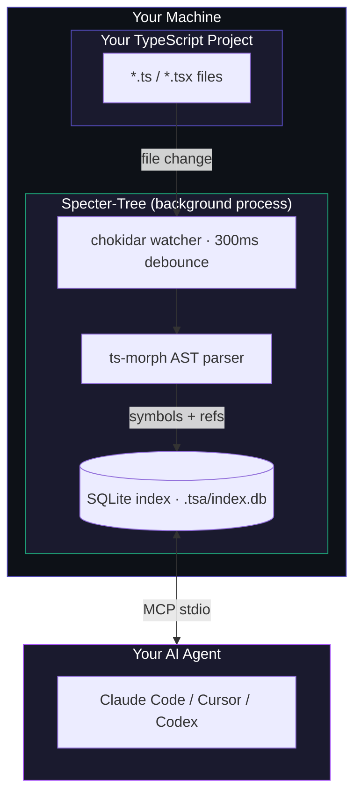

<div align="center">

<br />

# Specter-Tree

## Your AI reads 63% fewer tokens. Every single session.

**Give your coding agent a structural map of your TypeScript codebase —**
**so it stops guessing and starts knowing.**

<br />

[](LICENSE)
[](https://bun.sh)
[](https://modelcontextprotocol.io)
[]()
[](CONTRIBUTING.md)

<br />

[**Get Started in 60 Seconds →**](#-60-second-setup) · [See the Benchmark →](#-the-numbers) · [All 18 Tools →](#-the-18-tools)

<br />

</div>

---

## The Problem Nobody Talks About

Every time your AI agent touches your codebase, it pays a token tax.

It globs. It greps. It reads entire files to find 20 lines.
It opens the wrong file first. Then the right one. In full.

**You are paying for your AI to search your own code.**

---

## The Fix Takes 60 Seconds

Specter-Tree is an MCP server that gives your AI agent a live structural index of your TypeScript codebase — every symbol, every call site, every relationship, pre-resolved and queryable by name.

Instead of reading files, your agent asks questions:

```
"Where is handleRequest?"   →  server.ts, line 111. Done.
"What calls validateUser?"  →  4 call sites. Exact files and lines.
"What does AuthService extend?"  →  BaseService in base.service.ts:8.
```

No grep. No full-file reads. No wrong guesses.

---

## See It Side by Side

**Task: add a login check to `handleRequest`**

```
WITHOUT SPECTER-TREE                    WITH SPECTER-TREE
─────────────────────────               ──────────────────────────
Step 1  Glob all .ts files              Step 1  find_symbol("handleRequest")
        → 31 paths listed                       → server.ts, line 111

Step 2  Grep for "handleRequest"        Step 2  Read server.ts lines 111–130
        → 6 matches, scan output                → 20 lines, nothing else

Step 3  Read server.ts (full file)
        → 126 lines — needed 20

~1350 tokens                            ~500 tokens
```

> **Same task. Same edit. 63% fewer tokens. Every time.**

The savings compound as tasks get harder:

```
SIMPLE   find one function, edit it
─────────────────────────────────────────────────────────────────────────
█████████████████████████████████████████████████  1350 tok  Without
██████████████████                                  500 tok  With       63% saved

MEDIUM   trace callers across 3 files
─────────────────────────────────────────────────────────────────────────
███████████████████████████████████████████████████████████  2850 tok  Without
████████████████████                                          900 tok  With       68% saved

LARGE    map full inheritance, 15+ files
─────────────────────────────────────────────────────────────────────────
████████████████████████████████████████████████████████████████  4800 tok  Without
████████████████                                                  1000 tok  With       79% saved
```

**The larger the task, the bigger the gap.**

---

## ⚡ 60-Second Setup

**1. Install**
```bash
git clone https://github.com/DinoQuinten/specter-tree.git
cd specter-tree/tsa-mcp-server && bun install
```

**2. Run once to get your config**
```bash
bun run dev
```

**3. Copy the prompt it prints. Paste it into Claude Code, Codex, or Cursor.**

That's it. Your agent connects, scans your project, and starts using structural queries automatically. No env vars. No config files. No manual wiring.

> **Need Bun?** `curl -fsSL https://bun.sh/install | bash` — takes 10 seconds.

---

## Who Is This For?

**→ You use Claude Code, Codex CLI, or Cursor**
Your sessions get faster and cheaper. The agent makes fewer wrong reads and navigates large codebases confidently.

**→ You're building an AI dev tool**
Give your LLM structural code awareness without dumping whole files into context. Specter-Tree handles the indexing layer.

**→ Your codebase is large**
Grep doesn't scale. The bigger the project, the more time and tokens your agent wastes just finding things. Structural queries don't slow down as the codebase grows.

---

## 🔧 The 18 Tools

Your agent gets 18 structural tools the moment it connects.

### Find

| Tool | Result |
|---|---|
| `find_symbol("AuthService")` | `src/auth/auth.service.ts`, line 12 |
| `search_symbols("handler")` | All symbols with "handler" in the name |
| `get_file_symbols("server.ts")` | Every symbol declared in that file |
| `get_methods("UserController")` | All methods on `UserController` |

### Understand

| Tool | Result |
|---|---|
| `get_callers("validateUser")` | Every call site across the project |
| `get_hierarchy("BaseRepository")` | What it extends, what extends it |
| `get_implementations("IAuthGuard")` | All classes that implement it |
| `get_related_files("auth.service.ts")` | What it imports, what imports it |

### Framework-Aware

| Tool | Result |
|---|---|
| `trace_middleware("/api/users")` | Every middleware that runs before the handler |
| `get_route_config("/dashboard")` | Handler, guards, redirects |
| `resolve_config("build.outDir")` | Value + exact config file it came from |

### High-Level Insight *(saves the most tokens)*

| Tool | Result |
|---|---|
| `summarize_file_structure("auth.ts")` | Exports, classes, imports — no reading required |
| `explain_flow("processPayment")` | Full call graph from any entry point |
| `find_write_targets("UserSchema")` | Ranked: declaration → callers → implementors |
| `resolve_exports("src/index.ts", "createUser")` | Exact file behind the barrel export |

### Index Control

| Tool | Result |
|---|---|
| `set_project_root("/your/project")` | Bind + scan a workspace |
| `flush_file("auth.ts")` | Re-index immediately after an edit |
| `index_project("/your/project")` | Full re-scan |

---

## 📊 The Numbers

Measured on this repository (31 TypeScript files). Task: *add a startup greeting to the MCP server.* Run twice in opposite order to eliminate first-run bias.

| | Test 1 *(Specter first)* | Test 2 *(Grep first)* |
|---|---|---|
| **With Specter-Tree** | ~500 tok | ~800 tok |
| **Without Specter-Tree** | ~1350 tok | ~1750 tok |
| **Reduction** | **63%** | **54%** |

Breaking it down by stage:

| Stage | Without | With | Saved |
|---|---|---|---|
| Navigation | 400–450 tok | ~350 tok | 15% |
| Wrong file reads | 0–300 tok | 0 tok | **100%** |
| Correct file reads | ~850 tok (full file) | ~150 tok (20 lines) | **82%** |
| **Total** | **1350–1750 tok** | **500–800 tok** | **54–67%** |

> The biggest saving wasn't avoided wrong reads — it was partial reads. A line number turns a 126-line file read into a 20-line read. That single mechanism accounts for more than half the total saving.

---

## How It Works

Two processes. One pipe. Zero tokens on the server side.



**Specter-Tree** watches your files, parses them with ts-morph, and stores every symbol and reference in a local SQLite database. It uses zero tokens — it never talks to any AI.

**Your agent** connects over MCP stdio and queries the index instead of reading raw files.

### Index stays fresh automatically

| Event | Latency | How |
|---|---|---|
| File saved | ~300ms | chokidar debounce → re-index |
| File deleted | Immediate | Row removed |
| AI edits a file | Instant | `flush_file` bypasses debounce |
| Cold start | One-time | Two-pass scan; hash-skips unchanged files |
| Project switch | On demand | `set_project_root` tears down old state |

Each project's index lives at `{project_root}/.tsa/index.db`. Add `.tsa/` to `.gitignore` — it is generated output, not source.

---

## ❓ FAQ

**Do I need to configure anything manually?**
No. `bun run dev` prints the exact config with your real machine paths. Paste it once.

**Can two projects share one server?**
No — and that is by design. Each agent session gets its own dedicated process and its own index. Sessions never share state, so there is no cross-project contamination.

**How do I switch projects mid-session?**
Call `set_project_root("/path/to/other")`. The server closes the old index and opens the new one atomically. No reconnect needed.

**Where does the index live?**
`{project_root}/.tsa/index.db` — auto-created, wiped on every bind.

**Does it index `node_modules`?**
No. Your project files only. For external packages, fall back to grep.

**What agents are supported?**
Claude Code, Codex CLI, Cursor — anything that supports MCP stdio transport and can run `bun`.

---

## ⚠️ Known Limitations

The call graph is best-effort. These patterns are not resolved today:

- Dependency injection (`@Inject` providers)
- Event emitters (string-based event names)
- Dynamic dispatch (`obj[methodName]()`)
- Higher-order functions and callbacks

All call graph results include a `confidence` field so your agent knows when to verify:

| Value | What it means |
|---|---|
| `direct` | Static call expression — reliable |
| `inferred` | Resolved through a known pattern — likely correct |
| `weak` | Same name, compatible shape — verify before acting |

---

## 🤝 Contributing

### Add a language

The parser is TypeScript-only today. To add Python, Go, or Rust:

1. Implement the parser interface alongside `src/services/ParserService.ts`
2. Return the same `Symbol[]` and `Reference[]` structures
3. Register it for the relevant file extensions in `IndexerService`

### Add a framework

`trace_middleware` and `get_route_config` use `IFrameworkResolver`. Supported today: Express, Next.js, SvelteKit.

To add Fastify, Hono, Remix, or Nuxt:

1. Create `src/framework/your-framework-resolver.ts`
2. Implement `IFrameworkResolver`
3. Add detection in `FrameworkService.detectFrameworks()`

### Run locally

```bash
bun install
bun test              # 97 tests
bun run typecheck     # must exit clean
bun run dev           # start the server
```

Git hooks enforce quality on every push — secrets scan, duplicate symbol check, full test suite, type check.

---

## 🗺️ Roadmap

- [x] Offline indexer with incremental updates
- [x] Symbol and reference query tools
- [x] Framework detection and config resolution (Express, Next.js, SvelteKit)
- [x] Insight tools — summarize, flow, write targets, barrel exports
- [x] MCP Resources for browsing without tool calls
- [x] Coloured startup banner with ready-to-paste agent prompt
- [x] `set_project_root` — agent binds workspace without env vars
- [x] tsconfig `paths` alias resolution (`@/`, `~/`, custom aliases)
- [x] Benchmarked against Claude Code native tools
- [ ] `npx` install via npm package
- [ ] Language parser plugin system
- [ ] Python parser (tree-sitter)
- [ ] Selective `node_modules` indexing for SDK types
- [ ] Batch query tool (multiple queries, one MCP call)

---

## Environment Variables

Only needed for advanced setups. Normal usage requires none of these.

| Variable | Default | Description |
|---|---|---|
| `TSA_PROJECT_ROOT` | Auto-detected | Override initial root before `set_project_root` is called |
| `TSA_DB_PATH` | `{root}/.tsa/index.db` | Custom SQLite path |
| `LOG_LEVEL` | `info` | `debug` / `info` / `warn` / `error` |
| `NODE_ENV` | `development` | `development` / `production` |

---

<div align="center">

<br />

**If Specter-Tree saves you tokens, consider giving it a star. ⭐**

*It takes one second and helps other developers find it.*

<br />

</div>

---

## License

AGPL-3.0-only
